# miningos-wrk-miner-whatsminer

A worker service for managing and monitoring Whatsminer Bitcoin mining devices. This implementation provides comprehensive control over Whatsminer miners, including the models m30sp, m30spp, m53s, m56s, and, m63, with support for monitoring, configuration, and remote management.

## Table of Contents

1. [Overview](#overview)
2. [Object Model](#object-model)
3. [Features](#features)
4. [Requirements](#requirements)
5. [Installation](#installation)
6. [Configuration](#configuration)
7. [Usage](#usage)
8. [Data Collection](#data-collection)
9. [Error Monitoring](#error-monitoring)
10. [Protocol Details](#protocol-details)
11. [Mock Server](#mock-server)
12. [Development](#development)
13. [Troubleshooting](#troubleshooting)

## Overview

The Whatsminer worker extends the abstract miner worker framework to provide specific functionality for Whatsminer mining hardware. It implements an encrypted TCP connection for secure device communication and offers advanced power management and monitoring features.

## Object Model

The following is a fragment of [MiningOS object model](https://docs.mos.tether.io/) that contains the concrete classes representing  **Whatsminer miner workers** (highlighted in blue), one generically representing any model of the brand, and  child classes specifically representing models **M30SP**, **M30SPP**, **M53S**, **M56S**, and **M63**. The rounded nodes reprsent abstract classes while the square nodes represent concrete classes:

```mermaid
---
title: Object Model of MiningOS
---
flowchart RL
    bfx-wrk-base@{ shape: stadium, label: "*bfx-wrk-base*" }


    tether-wrk-base@{ shape: stadium, label: "*tether-wrk-base*" }
    tether-wrk-base--->bfx-wrk-base


    miningos-tlp-wrk-thing@{ shape: stadium, label: "*miningos-tlp-wrk-thing*" }
    miningos-tlp-wrk-thing--->tether-wrk-base


    miningos-tpl-wrk-miner@{ shape: stadium, label: "*miningos-tpl-wrk-miner*" }
    miningos-tpl-wrk-miner--->miningos-tlp-wrk-thing


    miningos-wrk-miner-whatsminer["miningos-wrk-miner-whatsminer"]
    miningos-wrk-miner-whatsminer--->miningos-tpl-wrk-miner

    miningos-wrk-miner-antminer["miningos-wrk-miner-antminer"]
    miningos-wrk-miner-antminer--->miningos-tpl-wrk-miner

    miningos-wrk-miner-avalon["miningos-wrk-miner-avalon"]
    miningos-wrk-miner-avalon--->miningos-tpl-wrk-miner


    miningos-wrk-miner-whatsminer-M30SP["miningos-wrk-miner-whatsminer-M30SP"]
    miningos-wrk-miner-whatsminer-M30SP--->miningos-wrk-miner-whatsminer

    miningos-wrk-miner-whatsminer-M30SPP["miningos-wrk-miner-whatsminer-M30SPP"]
    miningos-wrk-miner-whatsminer-M30SPP--->miningos-wrk-miner-whatsminer

    miningos-wrk-miner-whatsminer-M53S["miningos-wrk-miner-whatsminer-M53S"]
    miningos-wrk-miner-whatsminer-M53S--->miningos-wrk-miner-whatsminer

    miningos-wrk-miner-whatsminer-M56S["miningos-wrk-miner-whatsminer-M56S"]
    miningos-wrk-miner-whatsminer-M56S--->miningos-wrk-miner-whatsminer

    miningos-wrk-miner-whatsminer-M63["miningos-wrk-miner-whatsminer-M63"]
    miningos-wrk-miner-whatsminer-M63--->miningos-wrk-miner-whatsminer


    style miningos-wrk-miner-whatsminer fill:#005,stroke-width:4px
    style miningos-wrk-miner-whatsminer-M30SP fill:#005,stroke-width:4px
    style miningos-wrk-miner-whatsminer-M30SPP fill:#005,stroke-width:4px
    style miningos-wrk-miner-whatsminer-M53S fill:#005,stroke-width:4px
    style miningos-wrk-miner-whatsminer-M56S fill:#005,stroke-width:4px
    style miningos-wrk-miner-whatsminer-M63 fill:#005,stroke-width:4px
```



Check out [miningos-tpl-wrk-miner](https://github.com/tetherto/miningos-tpl-wrk-miner/) for more information about parent classes.

## Supported Models

- **M30SP**
- **M30SPP**
- **M53S**
- **M56S**
- **M63**

## Features

### Core Functionality
- Device Management: Register, update, and remove Whatsminer devices
- Secure Communication: AES-encrypted token authentication
- Real-time Monitoring: Comprehensive metrics collection and status tracking
- Pool Management: Configure and monitor up to 3 mining pools
- Advanced Power Control: Low, normal, high, and sleep power modes
- Network Configuration: DHCP and static IP support 

### Power Management
- Power Modes: Sleep, low, normal, and high performance modes
- Power Limiting: Set power consumption limits (watts)
- Frequency Control: Adjust mining frequency --- from -100% to +100% normal frequency (namely from 0 to double normal frequency)
- Fan Control: Zero-speed fan mode support
- Upfreq Speed: Control frequency ramping speed (0-100)

### Monitoring Capabilities
- Hashrate Tracking: 5s, 1m, 5m, 15m averages
- Temperature Monitoring: 
  - Chip-level temperatures (min/max/avg)
  - PCB temperatures per board
  - Ambient temperature
- Power Metrics: Consumption, efficiency (W/TH/s)
- Error Detection: Comprehensive error code monitoring
- Pool Statistics: Accepted, rejected, stale shares per pool

### Advanced Features
- Fast Boot: Enable/disable fast boot mode
- Web Pool Management: Enable/disable web-based pool configuration
- LED Control: Manual or automatic LED control
- Timezone Configuration: Set miner timezone
- PSU Information: Power supply unit monitoring

## Requirements

- Node.js (>= 20.0)

## Installation

1. Clone the repository
2. Install dependencies:
   ```bash
   npm install
   ```
3. Configure the worker:
   ```bash
   ./setup-config.sh
   ```
## Configuration

### Common Configuration (`config/common.json`)
```json
{
  "dir_log": "logs",
  "debug": 0
}
```

### Thing Configuration (`config/base.thing.json`)
```json
{
  "thing": {
    "minerDefaultPort": 4028,
    "miner": {
      "timeout": 30000,
      "nominalEfficiencyWThs": {
        "miner-wm-m30sp": 0,
        "miner-wm-m30spp": 0,
        "miner-wm-m53s": 0,
        "miner-wm-m56s": 0,
        "miner-wm-m63": 0
      }
    }
  }
}
```

**Note**: The `nominalEfficiencyWThs` values in the example configuration are set to 0. The worker uses default values from code if not overridden:
- M30SP/M30SPP: 33 W/TH/s (default)
- M53S/M56S/M63: 26 W/TH/s (default)

### Alert Configuration

Each model has specific alert configurations for various conditions:
- Temperature warnings (PCB, chip, inlet)
- Power errors and protection states
- Hashboard errors
- Pool connectivity issues
- EEPROM errors
- Control board exceptions

See `config/base.thing.json.example` for complete alert definitions per model.

## Usage

### Starting the Worker

```bash
node worker.js --wtype wrk-miner-rack-m56s --env production --rack rack-1

node worker.js --wtype wrk-miner-rack-m53s --env production --rack rack-2

node worker.js --wtype wrk-miner-rack-m30sp --env production --rack rack-3

node worker.js --wtype wrk-miner-rack-m30spp --env production --rack rack-4

node worker.js --wtype wrk-miner-rack-m63 --env production --rack rack-5
```

### Registering a Miner

```javascript
{
  "method": "registerThing",
  "params": {
    "opts": {
      "address": "192.168.1.100",
      "port": 4028,
      "password": "admin",
      "timeout": 30000,
      "type": "m56s"  // Model type
    },
    "info": {
      "serialNum": "WM123456",
      "macAddress": "00:11:22:33:44:55",
      "pos": "1",
      "container": "container-01"
    },
    "tags": ["production", "site-1"]
  }
}
```

### Available RPC Methods

Standard miner management methods:
- `getRack`: Get rack information
- `listThings`: List all managed miners
- `registerThing`: Register new miner
- `updateThing`: Update miner configuration
- `forgetThings`: Remove miners
- `queryThing`: Execute miner commands
- `applyThings`: Apply operations to multiple miners
- `tailLog`: Retrieve historical data

### Miner Control Commands

Execute commands via the `queryThing` RPC method:

#### Power Management
```javascript
// Set power mode
{
  "method": "queryThing",
  "params": {
    "id": "miner-id",
    "method": "setPowerMode",
    "params": ["high"]  // "sleep", "low", "normal", or "high"
  }
}

// Set power limit
{
  "method": "queryThing",
  "params": {
    "id": "miner-id",
    "method": "setPowerLimit",
    "params": [3000]  // Watts, use 99999 to reset
  }
}
```

#### Pool Configuration
```javascript
{
  "method": "queryThing",
  "params": {
    "id": "miner-id",
    "method": "setPools",
    "params": []
    }  
}
```

#### Frequency Control
```javascript
// Set frequency adjustment
{
  "method": "queryThing",
  "params": {
    "id": "miner-id",
    "method": "setFrequency",
    "params": ["10"]  // -100 to 100 percent
  }
}

// Set upfreq speed
{
  "method": "queryThing",
  "params": {
    "id": "miner-id",
    "method": "setUpfreqSpeed",
    "params": ["50"]  // 0 to 100
  }
}
```

#### Other Operations
```javascript
// Reboot
{ "method": "queryThing", "params": { "id": "miner-id", "method": "reboot", "params": [] }}

// Factory reset
{ "method": "queryThing", "params": { "id": "miner-id", "method": "factoryReset", "params": [] }}

// LED control
{ "method": "queryThing", "params": { "id": "miner-id", "method": "setLED", "params": [true] }}

// Enable fast boot
{ "method": "queryThing", "params": { "id": "miner-id", "method": "enableFastBoot", "params": [] }}
```

## Data Collection

Automatic snapshot collection includes:

### Statistics
- Status (mining, sleeping, error)
- Hashrate metrics (multiple time windows)
- Power consumption and efficiency
- Temperature data (chip, PCB, ambient)
- Pool share statistics
- Error codes and minor error flags

### Configuration
- Network settings (IP, DNS, gateway)
- Pool configuration
- Power mode and limits
- Firmware version
- LED status

## Error Monitoring

The system monitors numerous error conditions with model-specific handling:
- Power-related errors (over 20 types)
- Temperature errors and protection states
- Hashboard and EEPROM errors
- Pool connectivity issues
- Control board exceptions
- Firmware and software errors

Minor errors are distinguished from critical errors, allowing for nuanced monitoring.

## Protocol Details

### Authentication
1. Fetch token using admin password
2. All write operations require encrypted token
3. Token refresh on expiration (Code 135)

### Encryption
- AES encryption in ECB mode
- SHA256 key derivation
- JSON payload encryption for write operations

### Response Codes
- 131: Success
- 135: Token expired
- 136: IP limit exceeded
- 14: Invalid command

## Mock Server

A comprehensive mock server is provided for testing:

```bash
DEBUG="*" node mock/server.js --type M56s -p 8080 -h 0.0.0.0
DEBUG="*" node mock/server.js --type M53s -p 8080 -h 0.0.0.0
DEBUG="*" node mock/server.js --type M30sp -p 8080 -h 0.0.0.0
DEBUG="*" node mock/server.js --type M30spp -p 8080 -h 0.0.0.0
DEBUG="*" node mock/server.js --type M63 -p 8080 -h 0.0.0.0
```

The mock server simulates all Whatsminer commands and responses.

## Development

### Adding New Models

1. Create worker file extending base:
```javascript
class WrkMinerRackNewModel extends WrkMinerRack {
  getThingType() {
    return super.getThingType() + '-newmodel'
  }
}
```

2. Add model to constants:
- Nominal efficiency values
- Minor error codes (if applicable)

3. Configure model-specific alerts in base.thing.json

### Testing

```bash
npm test
```
